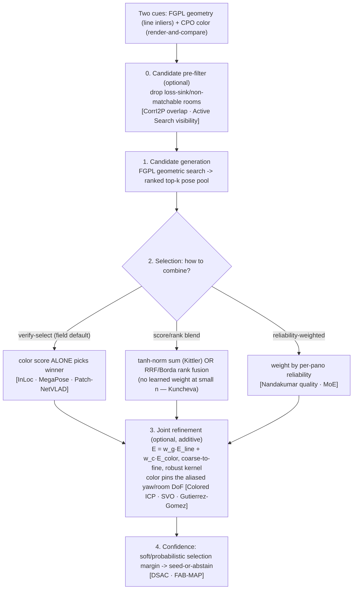

# Literature review — fusing geometric and photometric cues for camera-to-map localization

**Date:** 2026-07-14 · **Purpose:** ground PanoPin's FGPL(geometry)+CPO(color) fusion design
(`docs/specs/2026-07-14-candidate-fusion-design.md`) in how the field actually combines a geometric
localization cue with a photometric/appearance cue. **Method:** four parallel literature threads
(backbone family; tight/joint fusion; late fusion & verification; score-level fusion theory) over
arXiv, Semantic Scholar, OpenAlex, and publisher/project pages. ~40 papers screened, ~35 retained.
**Citation counts are approximate** (OpenAlex severely undercounts CVPR/ECCV; Google-Scholar-scale
figures used where noted). Every cited paper was located in live search with a working URL (see §8).

---

## 1. The two cues and why fusing them is well-motivated

- **Geometric cue (FGPL).** Aligns 2D panorama lines / vanishing directions / line intersections with
  3D map lines by an inlier-counting search over rotation×translation. **Fails** on same-shape rooms
  (no content) and is **Manhattan rotation-aliased** (a room looks geometrically self-similar under 90°
  yaw). Illumination-invariant, privacy-friendly.
- **Photometric cue (CPO / PICCOLO).** Projects the colored point cloud into the panorama at a candidate
  pose and scores color consistency (PICCOLO's per-point "sampling loss"; CPO's change-robust color
  histograms). **Fails** on windows / blank walls / occlusion. **Not** rotation-aliased (a red wall lies
  in exactly one direction) and **not** same-shape-blind (content differs room to room).

The two fail on **disjoint** inputs. That is the textbook precondition for fusion: each cue covers the
other's blind spot (Baltrušaitis et al. 2019; Kittler et al. 1998). Colored ICP (Park et al. 2017) makes
the sharper structural argument that maps directly onto our case: **the geometric term leaves certain
DoF weakly constrained, and the photometric term's job is precisely to pin those down.** For us the
geometry leaves the *room identity* and the *Manhattan yaw* ambiguous — exactly what color resolves.

## 2. Finding: within the PICCOLO→CPO→LDL→FGPL family, the cues are NEVER jointly fused

All four backbone papers are from **Seoul National University 3D Vision Lab** (Young Min Kim; Junho Kim =
`82magnolia`), *not* KAIST. They form two deliberately-opposite branches:

| Paper | Venue | Cue | Fusion? |
|---|---|---|---|
| **PICCOLO** (Kim et al.) | ICCV 2021 | color: per-point sampling loss | color-only |
| **CPO** (Kim et al.) | ECCV 2022 | color: change-robust histogram score-maps | color-only |
| **LDL** (Kim et al.) | ICCV 2023 | line distance functions (coarse) → color local-features (fine) | **sequential handoff**, coarse search is *deliberately color-free* |
| **FGPL** (Kim et al.) | CVPR 2024 | lines + vanishing dirs + intersections | geometry-only (color removed entirely) |

The lab frames lines as a **replacement** for color (for illumination robustness / privacy), not a
complement. LDL's line-coarse→color-fine cascade is the closest the family comes to using both, and even
there the *search* is color-free. **No paper computes a joint color+geometry score, and no fusion
follow-up or survey exists in this line of work.** → PanoPin's fusion is a genuine, defensible gap to fill
(useful for the thesis/paper novelty claim).

## 3. How the broader field fuses geometric + photometric cues (thematic synthesis)

### Theme A — Tight/joint cost (mainly for continuous *refinement*)
The dominant tight-fusion form is a single weighted sum of squared residuals minimized jointly over the
pose (Gauss-Newton/LM):

- **Colored ICP** — Park, Zhou, Koltun (ICCV 2017): `E = (1−δ)E_color + δ E_geom`, fixed scalar δ,
  coarse-to-fine voxel pyramid. The archetype; geometry (point-to-plane) fixes the normal direction,
  color fixes the in-plane DoF geometry can't. **Closest analogue to our line-geometry + color-projection
  setup.**
- **Generalized-ICP** — Segal, Haehnel, Thrun (RSS 2009): replace the hand-set weight with
  **covariance/information-matrix weighting** derived from each residual's uncertainty.
- **DSO** — Engel, Koltun, Cremers (TPAMI 2018): pure-photometric extreme; **Huber norm + gradient-based
  down-weighting + image-pyramid** coarse-to-fine — the robustness toolkit.
- **SVO** — Forster, Pizzoli, Scaramuzza (ICRA 2014): a **cascade, not a sum** — photometric alignment
  for the coarse pose, then *switch* to geometric reprojection for refinement. Precedent for a
  cue-per-stage pipeline.
- **RGB-D dense odometry** — Kerl, Sturm, Cremers (ICRA 2013): **Student-t IRLS** robust weighting;
  Gutiérrez-Gómez et al. (ICRA 2015): derive the photometric↔geometric weight **automatically from the
  empirical residual covariance** (and use inverse-depth to make the two terms commensurable) — the
  cleanest answer to "how do I set the weight?".

**Takeaway A:** if we add a joint *refinement* stage, the recipe is a weighted sum with (i) coarse-to-fine
annealing, (ii) a robust kernel on each term, (iii) the weight set by residual covariance rather than
guessed. Color pins the aliased yaw / room DoF that FGPL's line-only refine cannot.

### Theme B — Late fusion: hypothesize-and-verify / retrieve-then-verify (for *selection*)
This is the deployed default across VPR, object pose, cross-modal, and hierarchical localization:

- **InLoc** — Taira et al. (CVPR 2018): **the closest precedent to PanoPin.** Retrieve candidate poses →
  estimate a pose per candidate → **verify by virtual-view synthesis (render-and-compare) and pick the
  candidate with the best rendered-vs-query agreement.** The rendering score makes the *final selection*
  and can override the geometric ranking.
- **MegaPose** — Labbé et al. (CoRL 2022): a classifier **scores each rendered pose hypothesis** and the
  best is selected → render-and-compare as an explicit selector over a hypothesis pool.
- **Hierarchical localization (HF-Net/hloc)** — Sarlin et al. (CVPR 2019); **Patch-NetVLAD** — Hausler et
  al. (CVPR 2021): a cheap high-recall cue proposes a top-k shortlist; an expensive high-precision cue
  **re-ranks/selects** within it. Fusion is a hard cascade — proposal defines the pool, verifier decides.
- **Cross-modal image↔point-cloud** — DeepI2P (Li & Lee, CVPR 2021), CorrI2P (Ren et al., TCSVT 2022),
  **EP2P-Loc** (Kim et al., ICCV 2023, *evaluated on S3DIS/2D-3D-S* — our exact data): coarse matching
  proposes, geometric PnP/RANSAC verifies. CorrI2P's **overlap detector** and Active Search's (Sattler et
  al.) **visibility pruning** are explicit **candidate pre-filters** that discard non-matchable /
  loss-sink hypotheses before verification.
- **Loop closure** — FAB-MAP (Cummins & Newman), DBoW2 (Gálvez-López & Tardós, T-RO 2012): appearance
  proposes, **geometry vetoes** (RANSAC geometric check as a strict gate → false-positive-free).
- **DSAC** — Brachmann et al. (CVPR 2017): a learned **score over a pose-hypothesis pool** with **soft
  (probabilistic) selection** instead of hard argmax → enables calibrated confidence / differentiability.

**Takeaway B (the load-bearing one):** the localization field almost never blends the proposal and
verification scores by a tuned weighted sum. **The geometric search defines the candidate pool (high
recall, cheap); the render-and-compare score alone makes the final selection.** For PanoPin this says:
let FGPL emit the ranked top-k pose pool, and let CPO's color score *verify/select* within it — the exact
InLoc pattern.

### Theme C — If you do blend scores: normalization, sum vs rank, simple vs learned
- **Kittler et al. (TPAMI 1998):** the **sum rule is the most robust** combiner; product/min/max are
  destroyed by a single failed cue (if geometry collapses to ~0 on a symmetric scene, sum survives,
  product dies). 
- **Score normalization** — Jain, Nandakumar, Ross (Pattern Recognition 2005): make scores same-direction
  (negate the color residual), then **tanh (Hampel) normalization** is the robust default; min-max is
  outlier-sensitive (and a failed cue *is* an outlier).
- **Rank fusion** — Borda count (Ho, Hull, Srihari, TPAMI 1994) and **Reciprocal Rank Fusion** (Cormack et
  al., SIGIR 2009, k≈60): combine only the two candidate *orderings* → **immune to unit mismatch and to
  one badly-calibrated cue.** The strongest no-tuning default.
- **Fixed beats learned at small N** — Kuncheva (2004): with few, roughly-comparable, low-correlation
  cues and little held-out data, the plain mean/sum beats trained combiners (which overfit). **Our n=12
  regime → do not learn the fusion.**
- **Confidence/quality-weighted** — Nandakumar et al. (TPAMI 2008), mixture-of-experts (Jacobs et al.
  1991): weight each cue by a per-input reliability signal; principled but needs a cheap, trustworthy
  reliability estimate.

**Takeaway C:** if we blend rather than verify-select, use **RRF/Borda rank fusion** (no calibration) or
**tanh-normalized equal-weight sum**; do **not** use a learned or heavily-tuned weight at n=12.

## 4. Fusion-strategy taxonomy (where each option sits)

## 5. Implications for PanoPin + FGPL

1. **Prefer verify-select over weighted blending for the room/pose decision.** The design spec's default
   (symmetric rank-blend) is *valid theory* (Theme C) but the localization-specific evidence (Theme B,
   InLoc/MegaPose) favors **geometry-proposes, color-verifies-and-selects**. Test that first.
2. **Color-alone selection directly attacks BOTH current failure modes** — wrong-room (same-shape) and
   Manhattan rotation aliasing — because color is neither same-shape-blind nor rotation-invariant. This is
   the §1 colored-ICP argument realized at the *selection* stage.
3. **There is an under-used additive lever: joint refinement (Theme A).** FGPL refines by line alignment
   only, which is exactly why its rotation stays 90°-aliased even with a perfect position seed (RESULTS.md
   oracle rot median 90°). A colored-ICP-style joint refine, using PICCOLO's *differentiable* sampling
   loss as the color term, is the literature-standard fix and nothing else in our pipeline addresses it.
4. **Candidate pre-filtering is a recognized component** (CorrI2P/Active Search), which re-frames the old
   D21/D29 loss-sink problem as a standard pre-verification pruning step (its urgency is already reduced by
   the 3–5-room deployment reframing).
5. **Confidence = the selection margin** (DSAC/FAB-MAP soft selection) — folds the old "seed-or-abstain
   gate" question into the fusion cleanly, instead of the separate minmax gate that broke at scale (D29).
6. **Do not learn the fusion** (Kuncheva) — deterministic rules only, matching PanoPin's charter.

## 6. Promising fusion methods to test (the menu)

Ordered by expected value / cost. All reuse existing primitives (FGPL top-k pool; `residuals_at_pose`;
PICCOLO differentiable sampling loss). Each names the failure mode it targets and its precedent.

- **F1 — Verify-and-select (InLoc-style). [PRIMARY — test first]** FGPL emits the ranked top-k pose pool
  over all 3–5 rooms; **CPO color residual (raw-mean, `residuals_at_pose`) alone selects** the winner.
  *Targets:* wrong-room + rotation aliasing. *Precedent:* InLoc, MegaPose, Patch-NetVLAD. *Cost:* k cheap
  color scores on top of FGPL. Cheapest high-value option; the field default.
- **F2 — Score/rank blend. [bracket F1]** Same pool; selection = **RRF/Borda rank fusion** (no
  calibration) *or* tanh-normalized equal-weight sum of geometric-inlier + color scores. *Tests* whether
  keeping geometry's vote guards window/blank panos where color-alone (F1) over-commits. *Precedent:*
  Kittler (sum), Cormack (RRF), Ho (Borda).
- **F4 — Joint color+geometry refinement. [highest upside, additive]** After F1 selects, refine the
  continuous pose by `E = w_g·E_line + w_c·E_color` (color = PICCOLO sampling loss), coarse-to-fine, robust
  kernel, weight from residual covariance. *Targets:* the 90° rotation aliasing nothing else fixes.
  *Precedent:* Colored ICP, SVO, Gutiérrez-Gómez. *Cost:* an extra optimization; reuses differentiable
  color term.
- **F5 — Loss-sink pre-filter. [hygiene]** Drop degenerate/non-matchable rooms by an overlap/coverage test
  before scoring. *Precedent:* CorrI2P overlap, Active Search visibility. *Cost:* cheap; complements all.
- **F3 — Reliability-weighted blend. [only if F1/F2 leave reliability on the table]** Per-pano weight from
  cheap signals (color: residual spread / window fraction; geometry: inlier margin). *Precedent:*
  Nandakumar quality-based, MoE. *Cost:* needs a validated reliability signal — defer.
- **Confidence add-on:** the F1/F2 selection margin → calibrated seed-or-abstain (DSAC/FAB-MAP soft
  selection), replacing the D29 minmax gate.

**Recommended test order:** F1 (primary) → F2 (bracket) → F4 (additive upside) → F5/confidence → F3.

## 7. Limitations of this review

- Not a formal PRISMA systematic review; it is a targeted, design-informing survey. Screening was by
  relevance to the two-cue fusion question, prioritizing seminal / high-citation / on-topic work.
- Citation counts are approximate (OpenAlex undercounts conference papers by ~10–30×); venues/years/URLs
  were confirmed in live search. Two on-topic LiDAR-intensity BA papers' exact term-weighting formulas
  need a full-text read before quoting. "EP2P-Loc" and "CorrI2P" are unrelated works (different groups).
- The n=12 evaluation caveat (D26/D29) still governs: this review informs *which* methods to test; it does
  not substitute for measuring them on our data.

## 8. References (deduplicated; URLs verified in live search)

**Backbone family (SNU 3D Vision Lab):**
- Kim et al. *PICCOLO: Point Cloud-Centric Omnidirectional Localization.* ICCV 2021. arxiv.org/abs/2108.06545
- Kim et al. *CPO: Change Robust Panorama to Point Cloud Localization.* ECCV 2022. arxiv.org/abs/2207.05317
- Kim et al. *LDL: Line Distance Functions for Panoramic Localization.* ICCV 2023. arxiv.org/abs/2308.13989
- Kim et al. *Fully Geometric Panoramic Localization.* CVPR 2024. arxiv.org/abs/2403.19904

**Tight/joint fusion:**
- Park, Zhou, Koltun. *Colored Point Cloud Registration Revisited.* ICCV 2017.
- Segal, Haehnel, Thrun. *Generalized-ICP.* RSS 2009.
- Engel, Koltun, Cremers. *Direct Sparse Odometry.* TPAMI 2018. arxiv.org/abs/1607.02565
- Forster, Pizzoli, Scaramuzza. *SVO: Semi-Direct Visual Odometry.* ICRA 2014 / TRO 2017.
- Kerl, Sturm, Cremers. *Robust Odometry Estimation for RGB-D Cameras.* ICRA 2013.
- Gutiérrez-Gómez et al. *Inverse depth for accurate photometric and geometric error minimisation.* ICRA 2015.
- Mur-Artal et al. *ORB-SLAM.* T-RO 2015. · Alismail et al. *Photometric Bundle Adjustment.* ACCV 2016.
- Di Giammarino et al. *Photometric LiDAR and RGB-D Bundle Adjustment.* RA-L 2023. arxiv.org/abs/2303.16878

**Late fusion / verification:**
- Taira et al. *InLoc: Indoor Visual Localization with Dense Matching and View Synthesis.* CVPR 2018.
- Labbé et al. *MegaPose.* CoRL 2022. arxiv.org/abs/2212.06870 · Labbé et al. *CosyPose.* ECCV 2020.
- Li et al. *DeepIM.* ECCV 2018. · Xiang et al. *PoseCNN.* RSS 2018. · Aldoma et al. *Global Hypothesis Verification.* ECCV 2012.
- Sarlin et al. *From Coarse to Fine: Hierarchical Localization (HF-Net).* CVPR 2019. · Hausler et al. *Patch-NetVLAD.* CVPR 2021.
- Sarlin et al. *SuperGlue.* CVPR 2020. · Arandjelović et al. *NetVLAD.* CVPR 2016.
- Li & Lee. *DeepI2P.* CVPR 2021. · Ren et al. *CorrI2P.* TCSVT 2022. · Kim et al. *EP2P-Loc.* ICCV 2023. · Feng et al. *2D3D-MatchNet.* ICRA 2019.
- Sattler et al. *Active Search.* ICCV 2012 / PAMI 2016. · Cummins & Newman. *FAB-MAP.* IJRR 2008. · Gálvez-López & Tardós. *DBoW2.* T-RO 2012. · Brachmann et al. *DSAC.* CVPR 2017.

**Score-level fusion theory:**
- Kittler et al. *On Combining Classifiers.* TPAMI 1998. · Ross & Jain. *Information Fusion in Biometrics.* PRL 2003.
- Jain, Nandakumar, Ross. *Score Normalization in Multimodal Biometric Systems.* Pattern Recognition 2005.
- Ho, Hull, Srihari. *Decision Combination in Multiple Classifier Systems.* TPAMI 1994. · Cormack et al. *Reciprocal Rank Fusion.* SIGIR 2009.
- Baltrušaitis et al. *Multimodal Machine Learning: A Survey and Taxonomy.* TPAMI 2019. · Atrey et al. *Multimodal Fusion Survey.* Multimedia Systems 2010.
- Nandakumar et al. *Likelihood Ratio-Based Biometric Score Fusion.* TPAMI 2008. · Jacobs et al. *Adaptive Mixtures of Local Experts.* Neural Computation 1991.
- Fischler & Bolles. *RANSAC.* CACM 1981. · Viola & Jones. *Boosted Cascade.* CVPR 2001. · Kuncheva. *Combining Pattern Classifiers.* Wiley 2004.
